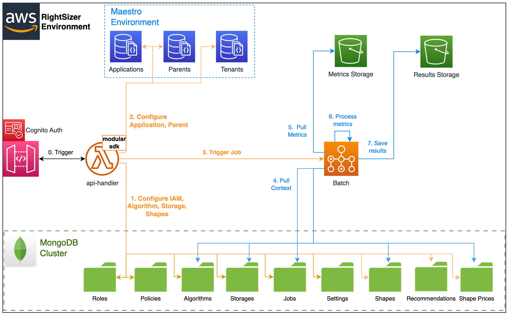
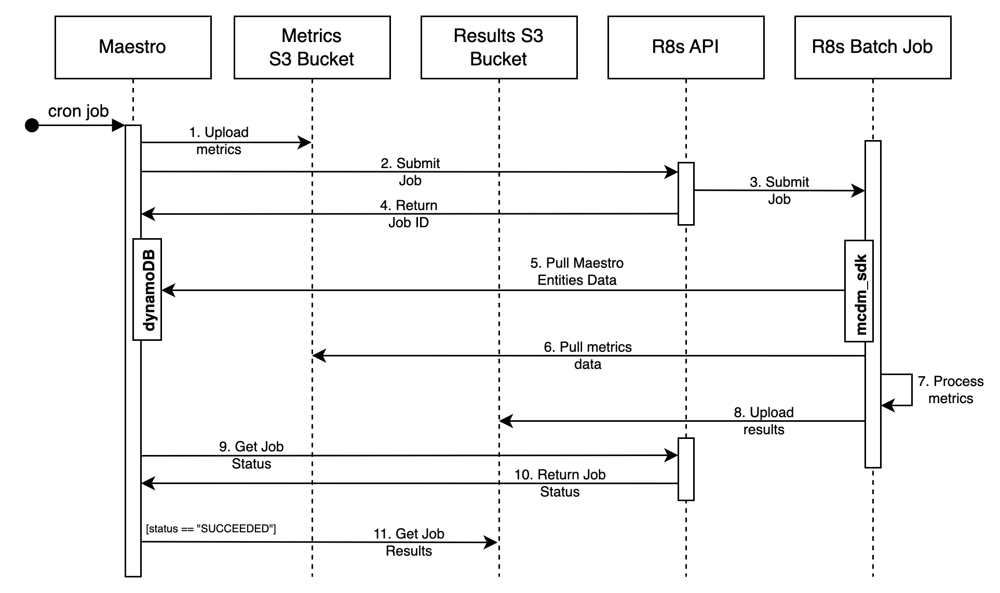

### Rightsizer Service

The application provides ability to provide resize/schedule recommendation for
cloud instances based on their activity metrics.

### Notice

All the technical details described below are actual for the particular
version, or a range of versions of the software.

### Actual for version: 2.10

## Rightsizer Service diagram

### Serverless Deployment Model



### On-Premises Deployment Model


### Maestro - RightSizer Workflow



## Lambdas description

### Lambda `r8s_api_handler`

This lambda is designed as a handler for all API resources:

* `/signup POST` - Creates new r8s user;
* `/signin POST` - Authenticates user in r8s service;
* `/policy CRUD` - Manage Policy entity;
* `/role CRUD` - Manage Role entity;
* `/users CRUD` - Manage User entity;
* `/algorithms CRUD` - Manage Algorithm entity;
* `/storages CRUD` - Manage Storage entity;
* `/storages/data GET` - To discover current metric files in storage;
* `/jobs/ CRUD` - Manage Job entity;
* `/reports/ POST` - Manage r8s reports;
* `/applications CRUD` - Manage Modular RIGHTSIZER Application entity;
* `/parents CRUD` - Manage Modular RIGHTSIZER Parent entity;
* `/parents/shape-rules CRUD` - Manage Parent shape rules filters;
* `/reports/mail/tenant POST` - Initiate tenant mail report sending flow;
* `/parents/insights/resize GET` - Manage Parent shape rules resize insights;
* `/shapes CRUD` - Manage Shape entity;
* `/shapes/prices CRUD` - Manage Shape Price entity;
* `/health-check GET` - Describes System status;

Refer to [r8s cli](r8s/README.md) for more details. It provides a separate 
command for each of the available endpoints.

---

### Lambda `r8s_job_updater`

This lambda is designed to update Jobs state in `Jobs` MongoDB table.
Triggered by CloudWatch Rule `r8s-job-state-update`.

---

### CLI Installation

10. Install CLI tool named r8s:

* create virtual environment `python -m venv .venv`
* activate environment `source .venv/bin/activate`
* run `pip install r8s/r8s`
* configure R8s api link

```text
r8s configure --api_link {api_link}
```

* Authenticate user

```text
r8s login --username {username} --password {password}
```

Refer to [r8s cli](r8s/README.md) for detailed description of available
commands.

## Deploy from scratch:

1. Create SSM parameter `r8s_mongodb_connection_uri` with MongoDB connection uri
2. Build docker image and put it to Elastic Container Registry
3. Configure syndicate configuration files:  
- 3.1 syndicate.yml
```yaml
account_id: account_id
aws_access_key_id: deployment_access_key
aws_secret_access_key: deployment_secret_key
deploy_target_bucket: name of the artifacts bucket name.
project_path: /path/to/r8s/src
region: deployment_region
resources_prefix: prefix (r8s-)
resources_suffix: suffix (-stg)
build_projects_mapping:
  python:
    - src/
```
- 3.2 syndicate_aliases.yml

```yaml
account_id: account_id
region: AWS region name
cognito_user_pool_name: congito user pool name
lambdas_alias_name: lambdas_alias (stage)
lambda_subnet_id: id of the subnet lambdas should be placed in.
lambda_security_group: id of the security group should be attached to lambdas.
batch_compenv_sg: id of the security group should be attached to AWS Batch Should be in the same VPC as a subnet batch_compenv_subnet
batch_compenv_subnet: id of the subnet AWS Batch should be placed in. Should be in the same VPC as a security group batch_compenv_sg
docker-image-url: docker image url from ECR used to deploy the service
r8s_job_queue: name of AWS Batch Job queue
r8s_job_definition: name of AWS Batch Job definition
log_level: DEBUG
DEBUG: True - to enable test metric generation by instance tags
logs_expiration: The expiration period of Lambda's CloudWatch logs in days
```
4. Export env variable `SDCT_CONF` which value is a path to folder
   where `syndicate_aliases.yml` and `syndicate.yml` are located.
5. Execute `syndicate create_deploy_target_bucket` to create s3 bucket for
   bundles.
6. Execute `syndicate build` and
   then `syndicate deploy --deploy_name r8s-service` commands.